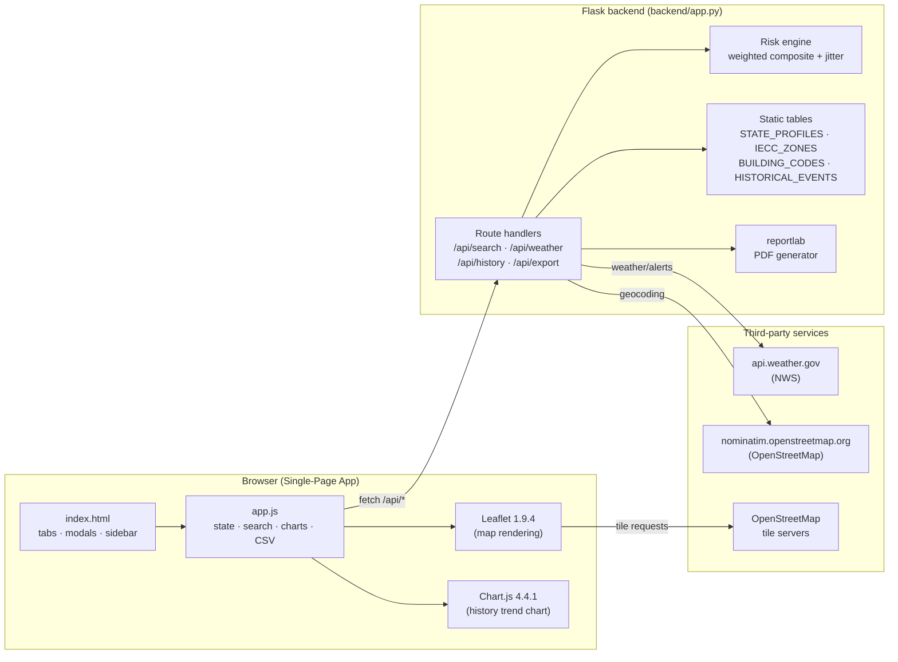

# GAD — System Design Document

| Field            | Value                                              |
| ---------------- | -------------------------------------------------- |
| Project          | Geospatial Architecture Database (GAD)             |
| Course           | CS 4398 — Software Engineering, Group 15           |
| Document version | 1.10                                               |
| Last updated     | 2026-05-01                                         |
| Status           | Living document — update with relevant code changes |
| Companion docs   | [README.md](./README.md), [Group15SRS.html](./Group15SRS.html) |

---

## 1. Purpose & scope

This document describes the implementation-level design of the Geospatial Architecture Database. It complements `Group15SRS.html` (the requirements spec, which defines *what* the system must do) by specifying *how* the system is built: components, data flow, algorithms, dependencies, and the mapping between requirements and code.

The intended audience is the development team (Group 15), the course instructor and TAs evaluating the project, and any future contributor extending the system.

---

## 2. References

| Ref       | Document                                            | Used for                                       |
| --------- | --------------------------------------------------- | ---------------------------------------------- |
| **SRS**   | [Group15SRS.html](./Group15SRS.html) (rev. 2026-04-28) | Authoritative requirements                  |
| **NWS**   | https://www.weather.gov/documentation/services-web-api | Forecast, alerts, point metadata           |
| **OSM**   | https://nominatim.org/release-docs/latest/api/Search/ | Geocoding API (forward and reverse)         |
| **IECC**  | International Energy Conservation Code 2021         | Climate-zone definitions                       |
| **IBC**   | International Building Code (state adoption survey) | Adopted code year per state                    |
| **ASCE 7**| Minimum Design Loads for Buildings and Other Structures | Snow/wind/seismic load references          |
| **FEMA P-320** | *Taking Shelter From the Storm*                | Safe-room construction standard                |
| **NOAA Storm Events** | https://www.ncei.noaa.gov/access/monitoring/products/ | Historical disaster aggregates       |

---

## 3. System overview

GAD is a single-page web application backed by a thin Flask service. The browser handles all rendering, mapping, charting, and CSV export; the backend acts as a proxy for third-party APIs (NWS, OSM Nominatim), runs the risk-scoring algorithm, joins in static reference tables, and renders PDF reports.

**Design goals** (derived from SRS Part 4):
- **Reliability** — round-trip under 5 s for a single location lookup (SRS §4.1).
- **Robustness** — every external call has a graceful failure path (SRS §4.2, §3.5).
- **Maintainability** — pinned dependencies, single-file backend, traceability to SRS sections (SRS §4.3).
- **Security** — no PII stored or persisted; all transport over HTTPS in production (SRS §4.4).
- **Usability** — keyboard navigation, screen-reader landmarks, colorblind-aware palette (SRS §4.5).

---

## 4. High-level architecture



The backend keeps no state between requests; every API call is independent. Recent searches and saved comparison sites live in `localStorage` on the client.

---

## 5. Component breakdown

### 5.1 Frontend

| File                      | Responsibility                                                                                              |
| ------------------------- | ----------------------------------------------------------------------------------------------------------- |
| `frontend/index.html`     | Page skeleton, ARIA landmarks, tab structure, export modal, comparison panel, offline banner.               |
| `frontend/app.js`         | App bootstrap, Leaflet init, debounced search, suggestion list with keyboard nav, recent-searches store, `/api/*` calls, tab routing, Chart.js render, CSV export, comparison state. |
| `frontend/styles.css`     | Glass-morphism theme, responsive grid, focus rings, color tokens, motion-safe animations.                   |

External libraries (loaded via CDN, not bundled): Leaflet 1.9.4, Chart.js 4.4.1, Inter & JetBrains Mono fonts (Google Fonts).

**Client-side persistence:** `localStorage` keys `gad.recent` (≤5 items), `gad.compare` (≤3 items), and `gad.layout` (`{sidebarWidth, mapHeight}` in pixels). No PII — coordinates, display name, timestamp, and layout dimensions only.

**Resizable layout:** The main page is a CSS Grid with two draggable splitters — a vertical splitter between the sidebar and the dashboard (resizes sidebar width), and a horizontal splitter between the map and the data panel (resizes map height). The splitters update CSS custom properties (`--gad-sidebar-w`, `--gad-map-h`) on `:root`, persist sizes to `gad.layout` in `localStorage`, and clamp to limits (sidebar 240–600 px, map 200–800 px) on both drag and `window.resize` events. Splitters are keyboard-accessible (arrow keys nudge by 16 px when focused), expose `role="separator"` with `aria-orientation` / `aria-valuenow` / `aria-valuemin` / `aria-valuemax`, and are hidden under the existing `@media (max-width: 960px)` responsive breakpoint where the layout collapses to a stacked flex column. Map height changes call `map.invalidateSize()` so Leaflet redraws cleanly.

### 5.2 Backend

`backend/app.py` is the Flask entry point: routes, the alert-info-URL helper, and the risk-scoring math. Static reference data lives in `backend/db/` (see §5.3); upstream resilience helpers live in two small modules at the same level:

| Module                       | Responsibility                                                                                                                       |
| ---------------------------- | ------------------------------------------------------------------------------------------------------------------------------------ |
| `backend/app.py`             | Flask routes, utility functions, audit-log writer, cache wrapper around `/api/weather`. `init_db()` runs at module load.             |
| `backend/http_session.py`    | Module-level `requests.Session` with a `urllib3` `Retry(total=2, backoff_factor=0.5, status_forcelist=(502,503,504))` adapter mounted on `https://` and `http://`. Pre-set User-Agent. Exported as `http`. Used everywhere the app calls NWS or Nominatim. |
| `backend/cache.py`           | Thread-safe `TTLCache(ttl_seconds, max_size)` with `OrderedDict` + `threading.Lock`, LRU eviction when over capacity, hit/miss counters, `.stats()` snapshot for `/api/cache/stats`. |

Logical sections inside `app.py`:

| Section            | Responsibility                                                                                |
| ------------------ | --------------------------------------------------------------------------------------------- |
| Imports + init     | Wires up the DB layer + retry session + weather TTL cache; `init_db()` runs at module load.   |
| Re-exports         | `RISK_CATEGORIES`, `CONSTRUCTION_TIPS`, `DEFAULT_PROFILE`, `DEFAULT_TRENDS` re-imported from `db.seed_data` so the PDF export path and the test suite can keep using them as Python dicts. They are the same constants the seed loader writes to the DB. |
| Utilities          | `normalize_state` (DB query), `jitter` (deterministic noise), `composite_from_scores` (uses `RISK_CATEGORIES` weights), `alert_info_url` (NWS-event → safety-URL mapping; see §9.1), `_record_analysis` (best-effort audit-log writer; see §8.6), `_weather_cache_key` (rounds lat/lon to 3 decimals). |
| Routes             | `/`, `/api/search`, `/api/weather`, `/api/history`, `/api/export`, `/api/health`, `/api/analyses/recent`, `/api/analyses/stats`, `/api/cache/stats`. |

`reportlab` is **lazy-imported** inside the export handler so the rest of the app can boot even when reportlab is not installed.

### 5.3 Data layer (`backend/db/` + `alembic/`)

| File                              | Responsibility                                                                                                  |
| --------------------------------- | --------------------------------------------------------------------------------------------------------------- |
| `backend/db/__init__.py`          | SQLAlchemy engine + `SessionLocal` factory + `get_session()` context manager + `init_db()` (`alembic upgrade head` then seed). DB URL comes from `GAD_DATABASE_URL` (default `sqlite:///backend/gad.db`; tests use `sqlite:///:memory:` with `StaticPool`). |
| `backend/db/models.py`            | SQLAlchemy 2.0 typed declarative models: `State`, `HistoricalEvent`, `DecadalTrend`, `RiskCategory`, `ConstructionTip`. See §8 for the full schema. |
| `backend/db/seed_data.py`         | The canonical Python representation of all reference data. Adding a new state or event only requires editing this file; the seed loader picks it up on the next boot. |
| `backend/db/seed.py`              | `seed_database(session)` — idempotent loader that walks the `seed_data` dicts and inserts rows. Short-circuits if the `states` table already has rows, so it's safe to call on every app boot. After the reference seed, calls `nri_loader.maybe_load_nri()` to populate `nri_counties`. |
| `backend/db/nri_loader.py`        | FEMA National Risk Index CSV loader. `maybe_load_nri(session, data_dir)` prefers `nri_counties.csv` (full FEMA download), falls back to `nri_sample.csv` (15 representative rows committed to the repo), no-ops when neither exists. `parse_nri_row()` is a pure function exposed for tests; normalizes FEMA's 0–100 hazard scores to our 0–10 internal scale and computes derived hazard categories (flood = max(coastal, riverine), winter = max(winter weather, ice storm, cold wave)). |
| `backend/data/nri_sample.csv`     | 15 representative counties hand-typed from public NRI documentation so a fresh checkout boots end-to-end without a network round-trip. Replaced by the full FEMA CSV when present (gitignored at `nri_counties.csv`). |
| `alembic.ini`                     | Alembic configuration (script_location, default URL — overridden at runtime). |
| `alembic/env.py`                  | Imports `db.models.Base`, reads `GAD_DATABASE_URL`, prefers a connection passed via `Config.attributes['connection']` over building its own engine. The latter is critical for in-memory SQLite tests where a separate engine would target a different `:memory:` database. |
| `alembic/script.py.mako`          | Template for new migration files (`alembic revision --autogenerate`). |
| `alembic/versions/`               | Committed migration revisions. Currently `0001_initial_schema` (creates all five tables + indexes). |

**Boot sequence:** `init_db()` opens a transaction on the application's existing engine, stuffs the connection into `Config.attributes['connection']`, calls `alembic.command.upgrade(cfg, "head")`, and then runs `seed_database`. Both steps are idempotent — Alembic skips already-applied revisions and the seed loader short-circuits when `states` is non-empty.

---

## 6. Data flow

The canonical "user clicks the map" interaction:

```mermaid
sequenceDiagram
    actor User
    participant UI as Browser (app.js)
    participant API as Flask backend
    participant OSM as Nominatim
    participant NWS as api.weather.gov

    User->>UI: Click point on Leaflet map
    UI->>UI: setMapView(lat, lon); show overlay
    UI->>API: GET /api/weather?lat=…&lon=…
    API->>NWS: GET /points/{lat,lon}
    NWS-->>API: forecast URL, state, etc.
    API->>NWS: GET {forecast URL}
    NWS-->>API: 7-day forecast periods
    API->>NWS: GET /alerts/active?area={state}
    NWS-->>API: active alerts for state

    alt state missing from NWS payload
        API->>OSM: GET /reverse?lat=…&lon=…
        OSM-->>API: address (state name)
    end

    API->>API: lookup STATE_PROFILES[state]
    API->>API: jitter scores by lat/lon
    API->>API: composite_from_scores(scores)
    API-->>UI: { forecast, alerts, scores, composite,<br/>climateZone, buildingCode, state }
    UI->>UI: render Overview, Forecast, Alerts,<br/>Risk Score, Build Tips tabs
```

The history tab is fetched on demand via `GET /api/history?state=XX`. Export flows post the assembled site object back to the server, which composes a styled PDF and streams it back as `application/pdf`.

---

## 7. API design

All endpoints return JSON unless noted. Errors carry an `{ "error": "…" }` payload and a meaningful HTTP status.

### 7.1 `GET /api/search?q={query}`

Forward geocoding (proxies Nominatim, scoped to the US).

- **Returns:** `[{ lat, lon, display }]`, max 5 results.
- **Constraints:** `len(q) ≥ 3`; below threshold returns `[]`.
- **Errors:** 503 if Nominatim is unreachable.

### 7.2 `GET /api/weather?lat={f}&lon={f}`

Single-call site analysis. Internally fans out to NWS (point lookup, forecast, alerts) and falls back to Nominatim reverse geocoding when NWS does not return a state.

- **Returns:**
  ```json
  {
    "forecast":   [{ "name", "temperature", "temperatureUnit", "shortForecast" }],
    "alerts":     [{ "event", "severity", "headline", "url" }],
    "scores":     { "hurricane", "tornado", "flood", "winter", "heat", "seismic", "wildfire" },
    "composite":  0,
    "observation": { "temperature", "windSpeed", "humidity", "conditions" },
    "state":      "FL",
    "climateZone": "1/2",
    "buildingCode": "FBC 2023 (IBC-based)"
  }
  ```
  The `url` field on each alert is computed server-side via `alert_info_url()` (see §9.1) and points to the NWS safety/info page for that hazard type (e.g. `weather.gov/safety/flood` for any flood alert). The Alerts tab renders the alert event name as a clickable link to this URL.
- **Errors:** 400 missing coords, 404 outside US (NWS rejects), 503 NWS unreachable.

### 7.3 `GET /api/history?state={XX}`

Notable disasters and decadal hazard-event count for a state.

- **Returns:** `{ events: [{year, event, severity, note}], trends: {decade: count}, state }`.
- Falls back to `DEFAULT_TRENDS` when the state has no curated entry.

### 7.4 `POST /api/export`

Body: the assembled site object from the client. Generates a multi-page styled PDF (cover summary, hazard table, recommendations, optional 7-day forecast, disclaimer).

- **Returns:** `application/pdf` with `Content-Disposition: attachment; filename=GAD_Report_YYYYMMDD.pdf`.
- **Errors:** 500 if reportlab is not installed.

### 7.5 `GET /api/health`

Liveness probe. Returns `{ status: "ok", time: <iso8601> }`.

### 7.6 `GET /api/analyses/recent`

Paginated list of recent `/api/weather` analyses (SRS §3.6 read API).

- **Query params:** `limit` (default 20, capped at 100), `offset` (default 0). Invalid values fall back to defaults rather than 4xx.
- **Returns:** `{ items: [{id, createdAt, lat, lon, state, composite, alertCount}, ...], total, limit, offset }`. Items are ordered by `created_at` descending.

### 7.8 `GET /api/cache/stats`

Operational view of the in-memory `/api/weather` TTL cache (SRS §4.1 reliability).

- **Returns:**
  ```json
  {
    "hits":        42,
    "misses":      8,
    "size":        7,
    "max_size":    1000,
    "ttl_seconds": 300,
    "hit_rate":    0.84
  }
  ```
  `hit_rate` is `hits / (hits + misses)` — `0.0` when the cache has never been queried. Backed by `cache.TTLCache.stats()`.

### 7.7 `GET /api/analyses/stats`

Aggregate statistics over the audit log (SRS §3.6 read API).

- **Returns:**
  ```json
  {
    "total":   123,
    "last24h": 17,
    "byState": { "FL": 41, "TX": 29, "CA": 18, ... },
    "byDay":   { "2026-04-30": 12, "2026-05-01": 5, ... }
  }
  ```
  `byDay` covers the trailing 14 days. Day buckets use `strftime('%Y-%m-%d', created_at)` against UTC timestamps. `byState` excludes the small fraction of analyses where NWS could not resolve a state.

---

## 8. Data model

The data layer uses **SQLAlchemy 2.0** declarative models against SQLite. Every static lookup table is a first-class entity; the previous Python dicts (`STATE_PROFILES`, `IECC_ZONES`, `BUILDING_CODES`, `HISTORICAL_EVENTS`, `DECADAL_TRENDS`, `RISK_CATEGORIES`, `CONSTRUCTION_TIPS`, `STATE_NAME_TO_CODE`) are now the seed source for these tables, populated by `db.seed.seed_database()` on first boot.

```mermaid
erDiagram
    states ||--o{ historical_events : "has"
    states ||--o{ decadal_trends    : "has"
    risk_categories ||--o{ construction_tips : "has"

    states {
        string code PK "2-letter (e.g. FL)"
        string full_name UK "e.g. Florida"
        string iecc_zone "1/2, 3, 4, ..."
        string building_code "FBC 2023, IBC 2021, ..."
        int hurricane "0-10"
        int tornado "0-10"
        int flood "0-10"
        int winter "0-10"
        int heat "0-10"
        int seismic "0-10"
        int wildfire "0-10"
    }
    historical_events {
        int id PK
        string state_code FK
        int year
        string event
        string severity
        string note
        string wiki "Wikipedia URL"
    }
    decadal_trends {
        string state_code PK_FK
        string decade PK "1980s, 1990s, ..."
        int count
    }
    risk_categories {
        string key PK "hurricane, tornado, ..."
        string label
        float weight
        string icon
        int sort_order
    }
    construction_tips {
        int id PK
        string hazard_key FK
        string tip
        int sort_order
    }
    analyses {
        int id PK
        datetime created_at "indexed; UTC"
        float lat
        float lon
        string state "indexed; nullable"
        int composite "0-100"
        int alert_count
    }
    nri_counties {
        string county_fips PK "5-digit (state+county)"
        string nws_zone_id "indexed (e.g. FLC057)"
        string state_code "indexed"
        string county_name
        int population
        float risk_score "0-100 NRI composite"
        string risk_rating
        float hurricane "0-10"
        float tornado "0-10"
        float flood "0-10"
        float winter "0-10"
        float heat "0-10"
        float seismic "0-10"
        float wildfire "0-10"
    }
```

The reference tables (states, historical_events, decadal_trends, risk_categories, construction_tips, nri_counties) are populated once by `db.seed.seed_database()` and never written to at runtime. The **`analyses` table** (SRS §3.6) is the only writable entity — every successful `/api/weather` call appends one row capturing anonymous request metadata. There is intentionally no foreign key from `analyses.state` to `states.code`: state lookups occasionally return null (NWS coverage gaps), and we want to record those analyses without falling back to a sentinel.

The state table consolidates four prior dicts (`STATE_PROFILES` + `IECC_ZONES` + `BUILDING_CODES` + `STATE_NAME_TO_CODE`) into a single row per state; `normalize_state` uses an `OR` query against `code` and `full_name` to accept either form. `RiskCategory` and `ConstructionTip` keep their `sort_order` columns so the original ordering of the Python lists (which the PDF export and frontend rely on) survives the round-trip through the database.

### 8.1 Risk taxonomy (`RISK_CATEGORIES`)

Seven hazard categories, each with a fixed weight summing to **1.00**:

| Hazard    | Weight |
| --------- | ------ |
| Hurricane | 0.20   |
| Tornado   | 0.18   |
| Flood     | 0.15   |
| Seismic   | 0.15   |
| Winter    | 0.12   |
| Heat      | 0.10   |
| Wildfire  | 0.10   |

Weights reflect the relative dollar-loss contribution each hazard has historically made to US construction-failure incidents (NOAA Storm Events, FEMA HMA program). They are **load-bearing**: any change here will shift composite scores nationwide. See §10 for the algorithm.

### 8.2 State profiles (`STATE_PROFILES`)

50 entries, one per US state, each a dict of per-hazard scores on a **0–10 scale**. Defaults applied via `DEFAULT_PROFILE` if a territory is requested.

### 8.3 IECC climate zones (`IECC_ZONES`)

Most-common IECC zone per state, expressed as either a single zone (`"3"`) or a range (`"3/4"`) for states that span multiple zones.

### 8.4 Building codes (`BUILDING_CODES`)

The currently adopted IBC year per state, with state-specific override labels for jurisdictions that adopt a derived code (`FBC 2023`, `CBC 2022`).

### 8.7 FEMA NRI counties (`NRICounty`)

County-level hazard scores from the FEMA National Risk Index. One row per US county; `nri_counties.csv` bundled by FEMA covers ~3,200 counties. The 15-county sample committed at `backend/data/nri_sample.csv` is sufficient to demo the lookup path; the full national dataset is gitignored and downloaded once via `curl` (see README).

Score normalization: FEMA publishes per-hazard scores on a 0–100 percentile scale. We divide by 10 in the loader so they line up with the existing 0–10 scale used by `State` profiles, `composite_from_scores()`, and `jitter()`. The composite `risk_score` column keeps the 0–100 NRI scale to preserve the standard presentation.

Hazard mapping from FEMA's 18 NRI categories to our 7:

| Our hazard | FEMA columns                       | Aggregation |
| ---------- | ---------------------------------- | ----------- |
| hurricane  | HRCN_RISKS                         | passthrough |
| tornado    | TRND_RISKS                         | passthrough |
| flood      | CFLD_RISKS, IFLD_RISKS             | max         |
| winter     | WNTW_RISKS, ISTM_RISKS, CWAV_RISKS | max         |
| heat       | HWAV_RISKS                         | passthrough |
| seismic    | ERQK_RISKS                         | passthrough |
| wildfire   | WFIR_RISKS                         | passthrough |

(Earlier versions of this loader used `RFLD_RISKS` and `EQKE_RISKS`, which don't exist in any FEMA NRI release — `IFLD_RISKS` is FEMA's actual code for inland flooding and `ERQK_RISKS` for earthquake. The wrong names silently parsed as zero, so flood was undercounted and seismic was always zero. `tests/test_routes.py::test_nri_loader_uses_correct_fema_column_names` pins the column names against regression.)

`/api/weather` extracts `nws_zone_id` from the NWS points response (URL like `/zones/county/FLC057` → `FLC057`) and queries `nri_counties` by that key. On hit, the response includes `countyName` and `riskSource: "FEMA National Risk Index"`. On miss, falls back to the State row and labels `riskSource: "state-level baseline"` so the UI can show appropriate attribution.

### 8.6 Audit log (`Analysis`)

Every successful `/api/weather` request appends one row. Schema (see §8 ER diagram for the full picture):

| Column        | Type      | Notes                                                                                  |
| ------------- | --------- | -------------------------------------------------------------------------------------- |
| `id`          | int PK    | autoincrement                                                                          |
| `created_at`  | datetime  | indexed; naive UTC (SQLite has no native tzinfo)                                       |
| `lat`         | float     | the user's clicked latitude, before any rounding                                       |
| `lon`         | float     | the user's clicked longitude                                                           |
| `state`       | str(2)    | indexed; **nullable** (NWS sometimes can't resolve a state for ocean coords)           |
| `composite`   | int       | 0–100; the composite risk score returned to the user                                   |
| `alert_count` | int       | active NWS alerts at the time of analysis                                              |

**Privacy posture (SRS §4.4 alignment):** No identity is stored — no IP address, no session id, no user id, no User-Agent. Coordinates are at the resolution the user clicked on a public map and are not reverse-looked-up to any address before storage. The intent of this table is operational visibility (which states are most analyzed, request rate over time, alert incidence), not user tracking. A future user-accounts feature would add a `user_id` column behind a feature flag, with retention controls documented separately.

**Best-effort write:** `app._record_analysis()` wraps the insert in a `try/except` that swallows everything. A DB outage during the write must never propagate to the user-facing analysis response. Tests verify this by patching `Session.commit` to raise and asserting `/api/weather` still returns 200.

### 8.5 Historical events (`HISTORICAL_EVENTS`)

Curated entries of catastrophic / severe events per state. **Coverage spans all 50 states + DC** (51 entries, ~87 events total) so every clickable point on the map produces meaningful history. Each state has 1–3 entries — disaster-prone states (FL, CA, NC, KY, HI, etc.) carry up to three; quieter states carry one representative event. The list is alphabetized by state code for maintenance.

Selection bias is toward educational salience (e.g. Andrew → FBC reform, Katrina → levee failure, Camp Fire → modern wildfire policy) rather than completeness; this is not a substitute for the NOAA Storm Events Database. Each entry carries:

| Field      | Purpose                                                                |
| ---------- | ---------------------------------------------------------------------- |
| `year`     | Event year (int).                                                      |
| `event`    | Display name (e.g. "Hurricane Katrina").                               |
| `severity` | One of `Catastrophic` / `Severe` — drives the pill color in the UI.    |
| `note`     | One-line context for the History tab.                                  |
| `wiki`     | Wikipedia article URL — frontend renders `event` as an external link.  |

The frontend defensively falls back to a Wikipedia search URL if `wiki` is missing, but every curated entry currently ships with a hand-verified link. Two tests guard the invariants:

- `tests/test_routes.py::test_history_every_curated_event_has_wiki_url` — every event has a `wiki` URL on `en.wikipedia.org`.
- `tests/test_routes.py::test_history_covers_all_us_states_and_dc` — coverage stays at all 50 states + DC, and `HISTORICAL_EVENTS` / `STATE_PROFILES` / `IECC_ZONES` / `BUILDING_CODES` keep the same key set so no state has partial data.

### 8.6 Decadal trends (`DECADAL_TRENDS`)

Hazard-events-per-decade for the last five decades, used by the History tab's Chart.js line chart. Defaults applied for states without curated data.

---

## 9. Algorithms

### 9.1 Alert info-URL mapping (`alert_info_url`)

NWS publishes ~100 distinct alert event types ("Tornado Warning", "Coastal Flood Advisory", "Wind Chill Watch", etc.). Each maps to a small set of stable safety/info pages on weather.gov (`/safety/tornado`, `/safety/flood`, `/safety/cold`, ...).

`alert_info_url(event_name)` walks an ordered list of `(substring, url)` rules and returns the first match, falling back to `weather.gov/alerts` for unrecognized event names. **Order is significant**: more-specific substrings come before less-specific ones, e.g. `"wind chill"` is checked before `"wind"` so a Wind Chill Warning resolves to `/safety/cold` rather than `/safety/wind`. The full rule list lives in `_ALERT_RULES` in `backend/app.py`. `tests/test_utils.py::TestAlertInfoUrl` covers the major hazard categories plus the precedence edge cases (13 tests).

### 9.2 Risk-scoring algorithm

Given a `(lat, lon)` and the resolved state code:

1. **Profile lookup.** `profile = STATE_PROFILES.get(state, DEFAULT_PROFILE)` — a 0–10 score per hazard.
2. **Jitter.** For each hazard `k`:
   `score_k = clamp_0_10( profile_k + round((seed - 0.5) * 2) )`
   where `seed = abs(sin(lat·12.9898 + lon·78.233)) mod 1`.
   This deterministically perturbs state-level scores by ±1 so neighboring locations within the same state vary slightly without being random per request.
3. **Weighted composite.**
   `composite = round( Σ_k (score_k · weight_k) / Σ_k (10 · weight_k) · 100 )`
   bounded to `[0, 100]`. Because weights sum to 1.0, the denominator is exactly `10`.
4. **Tip selection.** Frontend treats hazards with `score ≥ 3` as active, sorts by descending score, and renders the matching `CONSTRUCTION_TIPS` list.

The jitter is intentional: without it, every site within a state returns identical scores, which obscures the per-site nature of the recommendation. With it, adjacent sites differ by ≤1 in any single hazard but the overall ranking remains stable.

---

## 10. External dependencies

### 10.1 Runtime (Python)

| Package    | Version | Purpose                                       | SRS traceability      |
| ---------- | ------- | --------------------------------------------- | --------------------- |
| Flask      | 3.0.0   | WSGI app, routing, static-file serving        | §2.4, §2.5            |
| requests   | 2.31.0  | NWS + Nominatim HTTP client                   | §3.1, §3.2, §3.5      |
| reportlab  | 4.0.7   | Styled PDF generation                         | §3.3                  |
| SQLAlchemy | 2.0.36  | ORM for all reference data (SQLite by default; override via `GAD_DATABASE_URL`) | §4.3 |
| alembic    | 1.13.3  | Schema migrations — `init_db()` runs `alembic upgrade head` on every boot | §4.3 |

### 10.2 Development (Python, not required at runtime)

| Package      | Version | Purpose                                                |
| ------------ | ------- | ------------------------------------------------------ |
| pytest       | 8.3.3   | Test runner                                            |
| pytest-mock  | 3.14.0  | `mocker` fixture for cleaner mocking syntax            |
| ruff         | 0.6.9   | Linter (E/W/F/I/B/UP/SIM rule set; replaces flake8 + isort) |

Pins are exact (`==`) for reproducibility per SRS §4.3. See `backend/requirements.txt` and `backend/requirements-dev.txt` for transitive-dependency notes.

### 10.3 Frontend (CDN)

| Library    | Version | Purpose                                  |
| ---------- | ------- | ---------------------------------------- |
| Leaflet    | 1.9.4   | Interactive map + tile rendering         |
| Chart.js   | 4.4.1   | Decadal-trend line chart in History tab  |
| Google Fonts (Inter, JetBrains Mono) | n/a | Typography |

### 10.4 Network

The backend issues a `User-Agent: GAD/1.0 (cs4398@group15.com)` header on all outbound calls — required by the Nominatim usage policy. All calls have an 8-second timeout; failures map to 503 with a user-readable message.

---

## 11. Error-handling strategy

Per SRS §3.5 and §4.2, every external call is wrapped:

| Failure mode                          | Server response          | Client behavior                                |
| ------------------------------------- | ------------------------ | ---------------------------------------------- |
| NWS rejects coordinate (non-US)       | 404 + descriptive error  | Toast: "Only US locations are supported."      |
| NWS / Nominatim unreachable           | 503 + descriptive error  | Toast: "Service unavailable, retry shortly."   |
| Nominatim returns no match            | empty list               | Suggestions hidden; user re-prompted.          |
| Browser detects offline               | (no request)             | Persistent offline banner (`#offlineBanner`).  |
| reportlab not installed at export     | 500                      | Toast suggests `pip install reportlab`.        |
| Invalid lat/lon parameters            | 400                      | Form validation prevents submission.           |

The `pause and retry` flow described in SRS §3.5.2 is implemented via the toast + offline banner; in-flight retries are not queued (deferred to future work).

---

## 12. Non-functional compliance

| SRS section          | Requirement                              | Implementation evidence                                                                  |
| -------------------- | ---------------------------------------- | ---------------------------------------------------------------------------------------- |
| §4.1 Reliability     | ≤ 5 s for location lookup + data pull    | All upstream calls have 8 s per-request timeout. `http_session.py` mounts a `urllib3` `Retry` adapter (total=2, backoff=0.5, retry on 502/503/504) so transient NWS slowness silently retries instead of surfacing as 503. Repeat clicks on the same area within 5 minutes are sub-50 ms via the in-memory `TTLCache` in `cache.py` (see §7.8). |
| §4.2 Robustness      | Display all encountered errors           | See §11; all routes return JSON errors, frontend surfaces them via toast.                |
| §4.3 Maintainability | Periodic upkeep, contributor access      | Public GitHub repo, pinned deps, single-file backend, this design doc + SRS in tree, automated test suite (`tests/`, 36 tests) gated by GitHub Actions CI on every PR. |
| §4.4 Security        | No PII; HTTPS                            | No user accounts, no logging of coordinates server-side. Static tables only. HTTPS at deploy. |
| §4.5 Usability       | Accessibility, clean UI, broad audience  | ARIA roles + skip link + keyboard nav in `index.html`; focus rings + color-blind-aware palette in `styles.css`; resizable sidebar + map split (mouse + keyboard, persisted across sessions). |

---

## 13. SRS → implementation traceability

| SRS section                           | Requirement summary                          | Implementation                                                                       |
| ------------------------------------- | -------------------------------------------- | ------------------------------------------------------------------------------------ |
| §3.1 Leaflet + OpenStreetMap Integration | Display user location on a map            | `frontend/app.js:initMap`, `setMapView`; `backend/app.py:/api/search` (Nominatim).   |
| §3.1.1 UC1: display requested location | Render input on map                        | Map click handler + `/api/search` autocomplete.                                       |
| §3.1.2 UC2: cannot resolve location   | Show error                                   | `/api/search` returns 503 / empty; toast + suggestions hidden.                        |
| §3.2 Weather Data Retrieval/Analysis  | Pull NWS data                                | `/api/weather` proxies NWS point/forecast/alerts.                                     |
| §3.3 Data Export                      | PDF / CSV export                             | `/api/export` → reportlab; CSV via `app.js` `Blob` download.                          |
| §3.3.1 UC1: recommendations export    | Construction tips → file                     | PDF "Construction Recommendations" page; CSV `tips` rows.                             |
| §3.3.2 UC2: weather history export    | Forecast + history → file                    | PDF "7-Day Forecast" table; CSV `forecast` and `history` rows.                        |
| §3.4 Risk + recommendations           | Compute score, list recs                     | `composite_from_scores`, `RISK_CATEGORIES`, `CONSTRUCTION_TIPS`. County-level scores from FEMA NRI (`nri_counties` table; see §8.7) when the NWS county zone id resolves; state-level fallback otherwise. |
| §3.5.1 UC1: failure to find address   | Error message + retry                        | `/api/search` 503 + frontend toast; user remains on input.                            |
| §3.5.2 UC2: no internet               | Notify and pause                             | `online`/`offline` browser events drive `#offlineBanner`.                             |
| §3.6 Analytics & Audit Log            | Anonymous metadata per analysis              | `Analysis` model (§8.6); `app._record_analysis()` writes after every `/api/weather`. |
| §3.6.1 UC1: record analysis metadata  | Append row, never block user response        | Best-effort write — `try/except` swallows DB errors. Test guards the silence.         |
| §3.6.2 UC2: read recent analyses      | Paginated list + aggregate stats             | `GET /api/analyses/recent` (§7.6), `GET /api/analyses/stats` (§7.7).                   |
| §4.1 Reliability ≤ 5 s                | Performance budget                           | 8 s upstream timeout caps the per-call worst case; `urllib3` Retry adapter (total=2, backoff=0.5) absorbs transient 5xx blips; 5-minute TTL cache on `/api/weather` makes repeats sub-50 ms. Operational visibility via `/api/cache/stats`. |
| §4.2 Robustness                       | All errors surfaced                          | Centralized `try/except` in routes; toast UI in client.                               |
| §4.3 Maintainability                  | Periodic upkeep                              | Pinned deps, README + DESIGN living docs, GitHub PR workflow, pytest suite + ruff lint gated by GitHub Actions CI. |
| §4.4 Security                         | No PII; HTTPS                                | Stateless backend, no logging of inputs, deploy behind TLS.                           |
| §4.5 Usability                        | Accessibility + clean UI                     | Skip link, ARIA, focus rings, keyboard nav, motion-safe animations, draggable + keyboard-resizable sidebar/map splits with localStorage persistence. |

---

## 14. Deployment & operations

### Local development
`python3 backend/app.py` — see [README.md](./README.md#quick-start). Runs on port **5001**.

### Production (recommended profile)
- WSGI server: `gunicorn -w 2 -b 0.0.0.0:8000 backend.app:app` (gunicorn not pinned in `requirements.txt`; install in deployment image).
- Reverse proxy: Nginx for TLS termination and static-asset caching of `frontend/`.
- Caching: NWS + Nominatim responses are not cached server-side. If traffic grows, a 5-minute in-memory TTL cache on `/api/weather` would be the highest-leverage change.
- Observability: `/api/health` is the liveness probe. No metrics emitter today.

### Configuration
- `PORT` — server bind port (default 5001).
- `GAD_DATABASE_URL` — SQLAlchemy connection URL. Default: `sqlite:///backend/gad.db`. The test suite uses `sqlite:///:memory:` so CI never writes a file. Production deployments could swap in Postgres without code changes (no SQLite-specific SQL is used).

### Schema migrations

The schema is versioned with Alembic. `init_db()` runs `alembic upgrade head` on every app boot, so deployments don't need a separate migration step. To author a new migration during development:

```bash
# 1. Edit backend/db/models.py
# 2. Autogenerate the migration
alembic revision --autogenerate -m "describe the change"
# 3. Hand-review the file in alembic/versions/ (autogenerate has known
#    blind spots: index renames, FK name changes, server-default changes).
# 4. Commit. Next boot applies it automatically.
```

The `script.py.mako` template under `alembic/` produces files using modern Python typing syntax. `pyproject.toml` adds per-file ruff ignores under `alembic/versions/**/*.py` for the autogenerated boilerplate (`Union[X, None]`, trailing whitespace on the root `Revises:` line, unused imports) so generated migrations don't break CI without hand-editing.

### Continuous Integration

`.github/workflows/ci.yml` runs on every push to `main` and every pull request:

1. Checks out the repo and sets up Python 3.10 and 3.12 (matrix build).
2. Installs `backend/requirements-dev.txt` (which transitively pulls in runtime deps via `-r requirements.txt`).
3. Runs `ruff check .` — fails on any lint error.
4. Runs `pytest -v` — fails if any of the 36 tests fail.

Branch protection on `main` should require both matrix legs (Python 3.10 and 3.12) to pass before merging. CI uses pip's wheel cache keyed on the requirements files for faster reruns.

---

## 15. Future work / known limitations

- **Distributed cache.** The current `TTLCache` is in-process — fine for a single Flask worker, but a Gunicorn `-w 4` deployment would have four independent caches. A Redis-backed `TTLCache` swap (or even a shared file-based cache) would unify hit rates across workers and survive restarts.
- **Parallel upstream calls.** `/api/weather` calls NWS three times sequentially (point → forecast → alerts). The forecast URL depends on the points response, but the alerts call only needs the resolved state — it could run concurrently with the forecast call to cut worst-case latency another ~30%. Worth doing once we add either `requests-futures` or migrate to `httpx` async.
- **Admin UI on top of `/api/analyses`.** The audit-log read endpoints (§7.6, §7.7) ship without a frontend. A small admin dashboard page that polls `/stats` and renders a recent-activity table on top of `/recent` would be the next increment, ideally behind authentication.
- **Authoritative IECC + IBC data.** Per-state IECC zones and adopted IBC year are still hand-curated in `seed_data.py`. Could be replaced with a build-time pipeline pulling from ICC code-adoption feeds. (NRI hazard scores already moved off hand-curation in v1.10.)
- **NRI refresh automation.** The full FEMA NRI CSV is downloaded manually via `curl` per the README. A scheduled CI job that re-downloads + commits the file when FEMA publishes a new release would close the staleness gap.
- **Internationalization.** US-only by design (NWS coverage). Adding non-US support means swapping NWS for a global provider (e.g. Open-Meteo) and rebuilding the IBC table.
- **Persisted comparisons.** Comparisons live only in `localStorage`; no account / sync.
- **Retry queue.** When the user goes offline mid-flow, in-flight requests are dropped rather than queued (SRS §3.5.2 says "allow user to retry," and we do — by re-clicking — but a transparent queue would be friendlier).
- **PDF localization.** Reports are English-only; reportlab styles are hardcoded.
- **Frontend test coverage.** Backend has a 36-test pytest suite (utility, route, export) gated by CI; the frontend (`app.js`) has no automated coverage yet. A Playwright smoke test that loads the SPA, clicks a known city, and asserts the risk-score panel renders would be the next increment.

---

## 16. Revision history

| Date       | Author          | Change                                                                  |
| ---------- | --------------- | ----------------------------------------------------------------------- |
| 2026-04-28 | Brandon Stewart | Initial DESIGN.md created alongside README.md. Sourced from SRS rev. 2026-04-28 (Leaflet + OpenStreetMap mapping stack). |
| 2026-04-28 | Brandon Stewart | v1.1 — Added pytest suite (36 tests) and GitHub Actions CI. Updated §10 dependencies to split runtime vs. dev, §12 NFR compliance to cite the test suite, §13 traceability to cite CI for §4.3, §14 deployment to document the CI workflow, and §15 future work to refocus on frontend coverage. |
| 2026-04-28 | Brandon Stewart | v1.2 — History tab disasters are now clickable, deep-linking to the corresponding Wikipedia article (opens in new tab, `rel="noopener noreferrer"`). Added a `wiki` field to every entry in `HISTORICAL_EVENTS`; documented in §8.5. Added test guarding the invariant that every curated event ships with a wiki URL (suite now at 37 tests). |
| 2026-04-28 | Brandon Stewart | v1.3 — Expanded `HISTORICAL_EVENTS` from 10 states to 51 (all 50 + DC), ~87 hand-verified events with Wikipedia deep-links. Added DC to `STATE_PROFILES`, `IECC_ZONES`, `BUILDING_CODES`, and `STATE_NAME_TO_CODE` so DC clicks resolve as a region instead of falling back to defaults. New test `test_history_covers_all_us_states_and_dc` locks coverage and the four-table key parity. Suite now at 38 tests. |
| 2026-04-28 | Brandon Stewart | v1.4 — Active weather alerts in the Alerts tab are now clickable, deep-linking to the relevant NWS safety/info page (`weather.gov/safety/<topic>`). Added `alert_info_url()` helper and `_ALERT_RULES` ordered substring-matching table to `backend/app.py`; `/api/weather` now ships a `url` field on each alert. New §9.1 documents the algorithm and precedence rules. Frontend reuses the `.event-link` styling under a shared `.alert-link` class. Suite now at 52 tests (13 new `TestAlertInfoUrl` cases + 1 url assertion in the weather happy path). |
| 2026-04-28 | Brandon Stewart | v1.5 — Sidebar and map are now resizable via draggable splitters. CSS Grid layout driven by `--gad-sidebar-w` / `--gad-map-h` custom properties, sizes persisted to `localStorage` (`gad.layout`), keyboard-accessible (arrow keys), clamped to sensible bounds, hidden on narrow viewports. Map height changes trigger `map.invalidateSize()` so Leaflet redraws cleanly. Strengthens SRS §4.5 Usability traceability. Frontend-only change — backend untouched, suite still at 52 tests. |
| 2026-04-28 | Brandon Stewart | v1.6 — All static reference data migrated from in-app Python dicts to a SQLite database accessed via the SQLAlchemy 2.0 ORM. New `backend/db/` package: `models.py` (State, HistoricalEvent, DecadalTrend, RiskCategory, ConstructionTip), `seed_data.py` (canonical Python source), `seed.py` (idempotent loader), `__init__.py` (engine + `init_db()`). `app.py` imports `init_db()` at module load and queries the DB in `/api/weather`, `/api/history`, and `normalize_state`. `RISK_CATEGORIES` / `CONSTRUCTION_TIPS` re-exported from `seed_data` so the PDF path and tests still use them as dicts. New §5.3 documents the data layer; §8 rewritten as a SQLAlchemy schema with an entity-relationship diagram; §10.1 lists SQLAlchemy 2.0.36; §14 documents the new `GAD_DATABASE_URL` env var; §15 names Alembic as the next increment. Suite still at 52 tests, passing on both the in-memory test DB and the auto-seeded file DB. |
| 2026-04-30 | Brandon Stewart | v1.7 — Schema migrations now managed by Alembic. New `alembic.ini` + `alembic/` (env.py, script.py.mako, versions/) at the repo root. Initial migration `0001_initial_schema` generated via autogenerate covers all 5 tables, both FKs (with `ondelete=CASCADE`), all 3 indexes (`ix_states_full_name` unique, `ix_construction_tips_hazard_key`, `ix_historical_events_state_code`). `init_db()` swapped from `Base.metadata.create_all()` to `alembic.command.upgrade(cfg, "head")`, passing the application's existing engine connection via `Config.attributes['connection']` so in-memory SQLite tests continue to work. `env.py` prefers that connection over building its own engine — solves the classic Alembic + `:memory:` trap. Suite still at 52 tests; CI verifies `alembic upgrade head` on a clean file DB recovers the same schema. New §5.3 entries for `alembic.ini` / `alembic/env.py` / `alembic/versions/`; §10.1 adds alembic 1.13.3; §14 documents the schema-change workflow; §15 drops Alembic from future work. |
| 2026-05-01 | Brandon Stewart | v1.8 — Analytics & audit log (SRS §3.6). New `Analysis` model + `analyses` table (id, created_at indexed, lat, lon, state indexed nullable, composite, alert_count). Migration `0002_add_analyses_table` generated via autogenerate. `app._record_analysis()` writes one row after every `/api/weather` response with explicit best-effort try/except — tests verify a `Session.commit` failure produces no user-facing 5xx. Two new read endpoints: `GET /api/analyses/recent` (paginated, limit≤100) and `GET /api/analyses/stats` (totals + 24h count + by_state + by_day for the last 14 days). Suite expanded from 52 → 60 tests. New §7.6/§7.7 endpoint specs, §8 ER diagram includes `analyses`, new §8.6 documents the privacy posture and best-effort-write contract, §13 traceability rows for §3.6/§3.6.1/§3.6.2, §15 future work names an admin UI on top of these endpoints. SRS amendment in this same PR adds the §3.6 section and a TOC entry; SRS revision-history block notes the addition. |
| 2026-05-01 | Brandon Stewart | v1.9 — Weather-pipeline resilience (response to a real upstream-timeout incident reported on 2026-05-01 from Kansas-area clicks). New `backend/http_session.py` mounts a `urllib3` `Retry` adapter (total=2, backoff_factor=0.5, status_forcelist=(502,503,504)) on a shared `requests.Session`; all outbound calls in `app.py` migrated from `requests.get(...)` to `http.get(...)`. New `backend/cache.py` provides a thread-safe `TTLCache` (OrderedDict + Lock, LRU eviction, hit/miss counters); `/api/weather` now caches responses for 5 minutes keyed by `(round(lat,3), round(lon,3))` (~110m cell). Cache hits still write an Analysis row so the audit log remains accurate. New `GET /api/cache/stats` endpoint surfaces the cache hit-rate. Suite expanded 60 → 66 tests (cache miss-then-hit, nearby-coords-share-cell, TTL expiry via `time.monotonic` patch, `/api/cache/stats` shape + counters, retry adapter policy assertion). New conftest autouse fixture clears the cache between tests so ordering is irrelevant. New §5.2 module table includes `http_session.py` and `cache.py`; new §7.8 documents `/api/cache/stats`; §12 + §13 NFR/traceability rows for §4.1 cite both retries and caching; §15 drops the standalone "caching" item and adds two new items (distributed cache, parallel upstream calls). |
| 2026-05-01 | Brandon Stewart | v1.10 — FEMA National Risk Index integration. New `NRICounty` model + migration `0003_add_nri_counties_table` (county_fips PK, nws_zone_id indexed, state_code indexed, county_name, population, risk_score 0-100, risk_rating, plus 7 normalized 0-10 hazard scores). New `backend/db/nri_loader.py` parses FEMA's published CSV schema (STATEFIPS, COUNTYFIPS, HRCN_RISKS, etc.), normalizes 0-100 → 0-10, computes derived categories (flood = max(CFLD, RFLD); winter = max(WNTW, ISTM, CWAV)). 15-county sample committed at `backend/data/nri_sample.csv`; full ~3,200-county FEMA download is gitignored at `nri_counties.csv` and pulled via the curl command documented in README. `/api/weather` extracts the NWS county zone id from the points response and prefers NRI county scores when found, falling back to the existing `State`-level profile otherwise. Response gains `countyName` + `riskSource` fields. Frontend shows the county name in the location card and a "Source: FEMA National Risk Index" attribution under the composite-risk dial. Suite expanded 66 → 69 tests (NRI county hit, state-level fallback when the zone id is unknown, loader normalization sanity). New §5.3 entries for `nri_loader.py` + `nri_sample.csv`; §8 ER diagram includes `nri_counties`; new §8.7 documents the score normalization and FEMA → GAD hazard mapping; §10.2 lists FEMA NRI as a data source; §13 traceability for §3.4 cites the county-level upgrade; §15 drops authoritative-FEMA-data from future work and adds NRI refresh automation as the next increment. No SRS amendment needed — this strengthens §3.4 implementation without changing the contract. |
