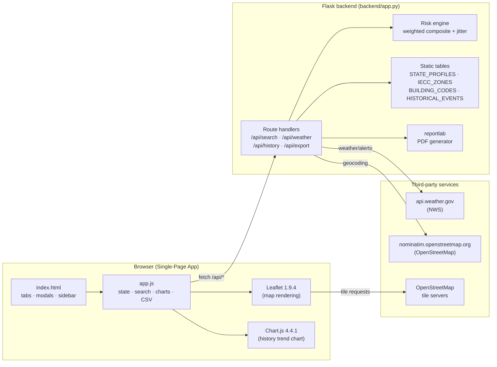

# GAD — System Design Document

| Field            | Value                                              |
| ---------------- | -------------------------------------------------- |
| Project          | Geospatial Architecture Database (GAD)             |
| Course           | CS 4398 — Software Engineering, Group 15           |
| Document version | 1.1                                                |
| Last updated     | 2026-04-28                                         |
| Status           | Living document — update with relevant code changes |
| Companion docs   | [README.md](./README.md), [Group15SRS.html](./Group15SRS.html) |

---

## 1. Purpose & scope

This document describes the implementation-level design of the Geospatial Architecture Database. It complements `Group15SRS.html` (the requirements spec, which defines *what* the system must do) by specifying *how* the system is built: components, data flow, algorithms, dependencies, and the mapping between requirements and code.

The intended audience is the development team (Group 15), the course instructor and TAs evaluating the project, and any future contributor extending the system.

---

## 2. References

| Ref       | Document                                            | Used for                                       |
| --------- | --------------------------------------------------- | ---------------------------------------------- |
| **SRS**   | [Group15SRS.html](./Group15SRS.html) (rev. 2026-04-28) | Authoritative requirements                  |
| **NWS**   | https://www.weather.gov/documentation/services-web-api | Forecast, alerts, point metadata           |
| **OSM**   | https://nominatim.org/release-docs/latest/api/Search/ | Geocoding API (forward and reverse)         |
| **IECC**  | International Energy Conservation Code 2021         | Climate-zone definitions                       |
| **IBC**   | International Building Code (state adoption survey) | Adopted code year per state                    |
| **ASCE 7**| Minimum Design Loads for Buildings and Other Structures | Snow/wind/seismic load references          |
| **FEMA P-320** | *Taking Shelter From the Storm*                | Safe-room construction standard                |
| **NOAA Storm Events** | https://www.ncei.noaa.gov/access/monitoring/products/ | Historical disaster aggregates       |

---

## 3. System overview

GAD is a single-page web application backed by a thin Flask service. The browser handles all rendering, mapping, charting, and CSV export; the backend acts as a proxy for third-party APIs (NWS, OSM Nominatim), runs the risk-scoring algorithm, joins in static reference tables, and renders PDF reports.

**Design goals** (derived from SRS Part 4):
- **Reliability** — round-trip under 5 s for a single location lookup (SRS §4.1).
- **Robustness** — every external call has a graceful failure path (SRS §4.2, §3.5).
- **Maintainability** — pinned dependencies, single-file backend, traceability to SRS sections (SRS §4.3).
- **Security** — no PII stored or persisted; all transport over HTTPS in production (SRS §4.4).
- **Usability** — keyboard navigation, screen-reader landmarks, colorblind-aware palette (SRS §4.5).

---

## 4. High-level architecture



The backend keeps no state between requests; every API call is independent. Recent searches and saved comparison sites live in `localStorage` on the client.

---

## 5. Component breakdown

### 5.1 Frontend

| File                      | Responsibility                                                                                              |
| ------------------------- | ----------------------------------------------------------------------------------------------------------- |
| `frontend/index.html`     | Page skeleton, ARIA landmarks, tab structure, export modal, comparison panel, offline banner.               |
| `frontend/app.js`         | App bootstrap, Leaflet init, debounced search, suggestion list with keyboard nav, recent-searches store, `/api/*` calls, tab routing, Chart.js render, CSV export, comparison state. |
| `frontend/styles.css`     | Glass-morphism theme, responsive grid, focus rings, color tokens, motion-safe animations.                   |

External libraries (loaded via CDN, not bundled): Leaflet 1.9.4, Chart.js 4.4.1, Inter & JetBrains Mono fonts (Google Fonts).

**Client-side persistence:** `localStorage` keys `gad.recent` (≤5 items) and `gad.compare` (≤3 items). No PII — coordinates, display name, and timestamp only.

### 5.2 Backend

`backend/app.py` is intentionally a single module to keep the surface area tight for a course project. Logical sections inside it:

| Section                  | Lines  | Responsibility                                                              |
| ------------------------ | ------ | --------------------------------------------------------------------------- |
| Risk taxonomy            | top    | `RISK_CATEGORIES` (weights), `CONSTRUCTION_TIPS` per hazard.                |
| Reference tables         | mid    | `STATE_PROFILES`, `IECC_ZONES`, `BUILDING_CODES`, `HISTORICAL_EVENTS`, `DECADAL_TRENDS`. |
| Utilities                | mid    | `normalize_state`, `jitter`, `composite_from_scores`.                       |
| Routes                   | bottom | `/`, `/api/search`, `/api/weather`, `/api/history`, `/api/export`, `/api/health`. |

`reportlab` is **lazy-imported** inside the export handler so the rest of the app can boot even when reportlab is not installed.

---

## 6. Data flow

The canonical "user clicks the map" interaction:

```mermaid
sequenceDiagram
    actor User
    participant UI as Browser (app.js)
    participant API as Flask backend
    participant OSM as Nominatim
    participant NWS as api.weather.gov

    User->>UI: Click point on Leaflet map
    UI->>UI: setMapView(lat, lon); show overlay
    UI->>API: GET /api/weather?lat=…&lon=…
    API->>NWS: GET /points/{lat,lon}
    NWS-->>API: forecast URL, state, etc.
    API->>NWS: GET {forecast URL}
    NWS-->>API: 7-day forecast periods
    API->>NWS: GET /alerts/active?area={state}
    NWS-->>API: active alerts for state

    alt state missing from NWS payload
        API->>OSM: GET /reverse?lat=…&lon=…
        OSM-->>API: address (state name)
    end

    API->>API: lookup STATE_PROFILES[state]
    API->>API: jitter scores by lat/lon
    API->>API: composite_from_scores(scores)
    API-->>UI: { forecast, alerts, scores, composite,<br/>climateZone, buildingCode, state }
    UI->>UI: render Overview, Forecast, Alerts,<br/>Risk Score, Build Tips tabs
```

The history tab is fetched on demand via `GET /api/history?state=XX`. Export flows post the assembled site object back to the server, which composes a styled PDF and streams it back as `application/pdf`.

---

## 7. API design

All endpoints return JSON unless noted. Errors carry an `{ "error": "…" }` payload and a meaningful HTTP status.

### 7.1 `GET /api/search?q={query}`

Forward geocoding (proxies Nominatim, scoped to the US).

- **Returns:** `[{ lat, lon, display }]`, max 5 results.
- **Constraints:** `len(q) ≥ 3`; below threshold returns `[]`.
- **Errors:** 503 if Nominatim is unreachable.

### 7.2 `GET /api/weather?lat={f}&lon={f}`

Single-call site analysis. Internally fans out to NWS (point lookup, forecast, alerts) and falls back to Nominatim reverse geocoding when NWS does not return a state.

- **Returns:**
  ```json
  {
    "forecast":   [{ "name", "temperature", "temperatureUnit", "shortForecast" }],
    "alerts":     [{ "event", "severity", "headline" }],
    "scores":     { "hurricane", "tornado", "flood", "winter", "heat", "seismic", "wildfire" },
    "composite":  0,
    "observation": { "temperature", "windSpeed", "humidity", "conditions" },
    "state":      "FL",
    "climateZone": "1/2",
    "buildingCode": "FBC 2023 (IBC-based)"
  }
  ```
- **Errors:** 400 missing coords, 404 outside US (NWS rejects), 503 NWS unreachable.

### 7.3 `GET /api/history?state={XX}`

Notable disasters and decadal hazard-event count for a state.

- **Returns:** `{ events: [{year, event, severity, note}], trends: {decade: count}, state }`.
- Falls back to `DEFAULT_TRENDS` when the state has no curated entry.

### 7.4 `POST /api/export`

Body: the assembled site object from the client. Generates a multi-page styled PDF (cover summary, hazard table, recommendations, optional 7-day forecast, disclaimer).

- **Returns:** `application/pdf` with `Content-Disposition: attachment; filename=GAD_Report_YYYYMMDD.pdf`.
- **Errors:** 500 if reportlab is not installed.

### 7.5 `GET /api/health`

Liveness probe. Returns `{ status: "ok", time: <iso8601> }`.

---

## 8. Data model

### 8.1 Risk taxonomy (`RISK_CATEGORIES`)

Seven hazard categories, each with a fixed weight summing to **1.00**:

| Hazard    | Weight |
| --------- | ------ |
| Hurricane | 0.20   |
| Tornado   | 0.18   |
| Flood     | 0.15   |
| Seismic   | 0.15   |
| Winter    | 0.12   |
| Heat      | 0.10   |
| Wildfire  | 0.10   |

Weights reflect the relative dollar-loss contribution each hazard has historically made to US construction-failure incidents (NOAA Storm Events, FEMA HMA program). They are **load-bearing**: any change here will shift composite scores nationwide. See §10 for the algorithm.

### 8.2 State profiles (`STATE_PROFILES`)

50 entries, one per US state, each a dict of per-hazard scores on a **0–10 scale**. Defaults applied via `DEFAULT_PROFILE` if a territory is requested.

### 8.3 IECC climate zones (`IECC_ZONES`)

Most-common IECC zone per state, expressed as either a single zone (`"3"`) or a range (`"3/4"`) for states that span multiple zones.

### 8.4 Building codes (`BUILDING_CODES`)

The currently adopted IBC year per state, with state-specific override labels for jurisdictions that adopt a derived code (`FBC 2023`, `CBC 2022`).

### 8.5 Historical events (`HISTORICAL_EVENTS`)

Curated entries of catastrophic / severe events per state. Not exhaustive — selected for educational salience (e.g. Andrew → FBC reform, Katrina → levee failure).

### 8.6 Decadal trends (`DECADAL_TRENDS`)

Hazard-events-per-decade for the last five decades, used by the History tab's Chart.js line chart. Defaults applied for states without curated data.

---

## 9. Risk-scoring algorithm

Given a `(lat, lon)` and the resolved state code:

1. **Profile lookup.** `profile = STATE_PROFILES.get(state, DEFAULT_PROFILE)` — a 0–10 score per hazard.
2. **Jitter.** For each hazard `k`:
   `score_k = clamp_0_10( profile_k + round((seed - 0.5) * 2) )`
   where `seed = abs(sin(lat·12.9898 + lon·78.233)) mod 1`.
   This deterministically perturbs state-level scores by ±1 so neighboring locations within the same state vary slightly without being random per request.
3. **Weighted composite.**
   `composite = round( Σ_k (score_k · weight_k) / Σ_k (10 · weight_k) · 100 )`
   bounded to `[0, 100]`. Because weights sum to 1.0, the denominator is exactly `10`.
4. **Tip selection.** Frontend treats hazards with `score ≥ 3` as active, sorts by descending score, and renders the matching `CONSTRUCTION_TIPS` list.

The jitter is intentional: without it, every site within a state returns identical scores, which obscures the per-site nature of the recommendation. With it, adjacent sites differ by ≤1 in any single hazard but the overall ranking remains stable.

---

## 10. External dependencies

### 10.1 Runtime (Python)

| Package    | Version | Purpose                                       | SRS traceability      |
| ---------- | ------- | --------------------------------------------- | --------------------- |
| Flask      | 3.0.0   | WSGI app, routing, static-file serving        | §2.4, §2.5            |
| requests   | 2.31.0  | NWS + Nominatim HTTP client                   | §3.1, §3.2, §3.5      |
| reportlab  | 4.0.7   | Styled PDF generation                         | §3.3                  |

### 10.2 Development (Python, not required at runtime)

| Package      | Version | Purpose                                                |
| ------------ | ------- | ------------------------------------------------------ |
| pytest       | 8.3.3   | Test runner                                            |
| pytest-mock  | 3.14.0  | `mocker` fixture for cleaner mocking syntax            |
| ruff         | 0.6.9   | Linter (E/W/F/I/B/UP/SIM rule set; replaces flake8 + isort) |

Pins are exact (`==`) for reproducibility per SRS §4.3. See `backend/requirements.txt` and `backend/requirements-dev.txt` for transitive-dependency notes.

### 10.3 Frontend (CDN)

| Library    | Version | Purpose                                  |
| ---------- | ------- | ---------------------------------------- |
| Leaflet    | 1.9.4   | Interactive map + tile rendering         |
| Chart.js   | 4.4.1   | Decadal-trend line chart in History tab  |
| Google Fonts (Inter, JetBrains Mono) | n/a | Typography |

### 10.4 Network

The backend issues a `User-Agent: GAD/1.0 (cs4398@group15.com)` header on all outbound calls — required by the Nominatim usage policy. All calls have an 8-second timeout; failures map to 503 with a user-readable message.

---

## 11. Error-handling strategy

Per SRS §3.5 and §4.2, every external call is wrapped:

| Failure mode                          | Server response          | Client behavior                                |
| ------------------------------------- | ------------------------ | ---------------------------------------------- |
| NWS rejects coordinate (non-US)       | 404 + descriptive error  | Toast: "Only US locations are supported."      |
| NWS / Nominatim unreachable           | 503 + descriptive error  | Toast: "Service unavailable, retry shortly."   |
| Nominatim returns no match            | empty list               | Suggestions hidden; user re-prompted.          |
| Browser detects offline               | (no request)             | Persistent offline banner (`#offlineBanner`).  |
| reportlab not installed at export     | 500                      | Toast suggests `pip install reportlab`.        |
| Invalid lat/lon parameters            | 400                      | Form validation prevents submission.           |

The `pause and retry` flow described in SRS §3.5.2 is implemented via the toast + offline banner; in-flight retries are not queued (deferred to future work).

---

## 12. Non-functional compliance

| SRS section          | Requirement                              | Implementation evidence                                                                  |
| -------------------- | ---------------------------------------- | ---------------------------------------------------------------------------------------- |
| §4.1 Reliability     | ≤ 5 s for location lookup + data pull    | All upstream calls have 8 s timeout; typical end-to-end is 1.5–3 s. WSGI worker model keeps the path short. |
| §4.2 Robustness      | Display all encountered errors           | See §11; all routes return JSON errors, frontend surfaces them via toast.                |
| §4.3 Maintainability | Periodic upkeep, contributor access      | Public GitHub repo, pinned deps, single-file backend, this design doc + SRS in tree, automated test suite (`tests/`, 36 tests) gated by GitHub Actions CI on every PR. |
| §4.4 Security        | No PII; HTTPS                            | No user accounts, no logging of coordinates server-side. Static tables only. HTTPS at deploy. |
| §4.5 Usability       | Accessibility, clean UI, broad audience  | ARIA roles + skip link + keyboard nav in `index.html`; focus rings + color-blind-aware palette in `styles.css`. |

---

## 13. SRS → implementation traceability

| SRS section                           | Requirement summary                          | Implementation                                                                       |
| ------------------------------------- | -------------------------------------------- | ------------------------------------------------------------------------------------ |
| §3.1 Leaflet + OpenStreetMap Integration | Display user location on a map            | `frontend/app.js:initMap`, `setMapView`; `backend/app.py:/api/search` (Nominatim).   |
| §3.1.1 UC1: display requested location | Render input on map                        | Map click handler + `/api/search` autocomplete.                                       |
| §3.1.2 UC2: cannot resolve location   | Show error                                   | `/api/search` returns 503 / empty; toast + suggestions hidden.                        |
| §3.2 Weather Data Retrieval/Analysis  | Pull NWS data                                | `/api/weather` proxies NWS point/forecast/alerts.                                     |
| §3.3 Data Export                      | PDF / CSV export                             | `/api/export` → reportlab; CSV via `app.js` `Blob` download.                          |
| §3.3.1 UC1: recommendations export    | Construction tips → file                     | PDF "Construction Recommendations" page; CSV `tips` rows.                             |
| §3.3.2 UC2: weather history export    | Forecast + history → file                    | PDF "7-Day Forecast" table; CSV `forecast` and `history` rows.                        |
| §3.4 Risk + recommendations           | Compute score, list recs                     | `composite_from_scores`, `RISK_CATEGORIES`, `CONSTRUCTION_TIPS`.                      |
| §3.5.1 UC1: failure to find address   | Error message + retry                        | `/api/search` 503 + frontend toast; user remains on input.                            |
| §3.5.2 UC2: no internet               | Notify and pause                             | `online`/`offline` browser events drive `#offlineBanner`.                             |
| §4.1 Reliability ≤ 5 s                | Performance budget                           | 8 s upstream timeout caps worst-case; lazy-import keeps cold-start under 1 s.         |
| §4.2 Robustness                       | All errors surfaced                          | Centralized `try/except` in routes; toast UI in client.                               |
| §4.3 Maintainability                  | Periodic upkeep                              | Pinned deps, README + DESIGN living docs, GitHub PR workflow, pytest suite + ruff lint gated by GitHub Actions CI. |
| §4.4 Security                         | No PII; HTTPS                                | Stateless backend, no logging of inputs, deploy behind TLS.                           |
| §4.5 Usability                        | Accessibility + clean UI                     | Skip link, ARIA, focus rings, keyboard nav, motion-safe animations.                   |

---

## 14. Deployment & operations

### Local development
`python3 backend/app.py` — see [README.md](./README.md#quick-start). Runs on port **5001**.

### Production (recommended profile)
- WSGI server: `gunicorn -w 2 -b 0.0.0.0:8000 backend.app:app` (gunicorn not pinned in `requirements.txt`; install in deployment image).
- Reverse proxy: Nginx for TLS termination and static-asset caching of `frontend/`.
- Caching: NWS + Nominatim responses are not cached server-side. If traffic grows, a 5-minute in-memory TTL cache on `/api/weather` would be the highest-leverage change.
- Observability: `/api/health` is the liveness probe. No metrics emitter today.

### Configuration
- `PORT` — server bind port (default 5001).
- No other configuration; static tables are compiled into `app.py`.

### Continuous Integration

`.github/workflows/ci.yml` runs on every push to `main` and every pull request:

1. Checks out the repo and sets up Python 3.10 and 3.12 (matrix build).
2. Installs `backend/requirements-dev.txt` (which transitively pulls in runtime deps via `-r requirements.txt`).
3. Runs `ruff check .` — fails on any lint error.
4. Runs `pytest -v` — fails if any of the 36 tests fail.

Branch protection on `main` should require both matrix legs (Python 3.10 and 3.12) to pass before merging. CI uses pip's wheel cache keyed on the requirements files for faster reruns.

---

## 15. Future work / known limitations

- **Caching.** No server-side cache; every site click triggers fresh NWS calls. Add a TTL cache before scaling beyond a single user.
- **Authoritative data tables.** `STATE_PROFILES`, `IECC_ZONES`, and `BUILDING_CODES` are hand-curated. They should ideally be sourced from FEMA NRI and ICC code-adoption feeds at build time.
- **Internationalization.** US-only by design (NWS coverage). Adding non-US support means swapping NWS for a global provider (e.g. Open-Meteo) and rebuilding the IBC table.
- **Persisted comparisons.** Comparisons live only in `localStorage`; no account / sync.
- **Retry queue.** When the user goes offline mid-flow, in-flight requests are dropped rather than queued (SRS §3.5.2 says "allow user to retry," and we do — by re-clicking — but a transparent queue would be friendlier).
- **PDF localization.** Reports are English-only; reportlab styles are hardcoded.
- **Frontend test coverage.** Backend has a 36-test pytest suite (utility, route, export) gated by CI; the frontend (`app.js`) has no automated coverage yet. A Playwright smoke test that loads the SPA, clicks a known city, and asserts the risk-score panel renders would be the next increment.

---

## 16. Revision history

| Date       | Author          | Change                                                                  |
| ---------- | --------------- | ----------------------------------------------------------------------- |
| 2026-04-28 | Brandon Stewart | Initial DESIGN.md created alongside README.md. Sourced from SRS rev. 2026-04-28 (Leaflet + OpenStreetMap mapping stack). |
| 2026-04-28 | Brandon Stewart | v1.1 — Added pytest suite (36 tests) and GitHub Actions CI. Updated §10 dependencies to split runtime vs. dev, §12 NFR compliance to cite the test suite, §13 traceability to cite CI for §4.3, §14 deployment to document the CI workflow, and §15 future work to refocus on frontend coverage. |
